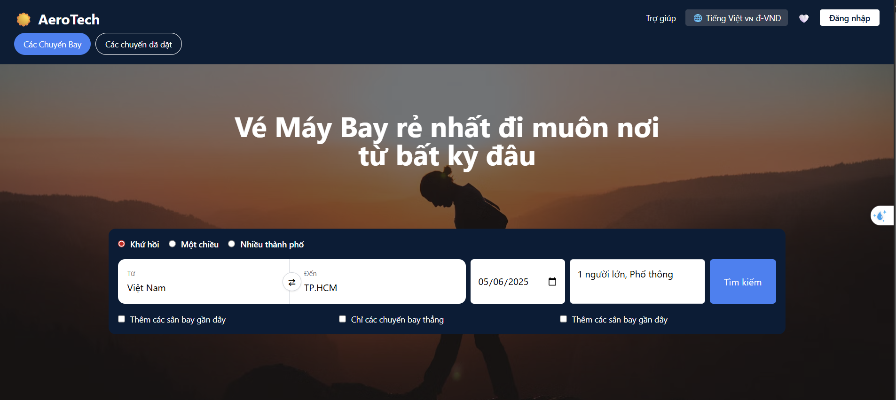

<h1 align="center">✈️ AirplaneTicketSeller</h1>

<p align="center"><i>
A final project for Introduction to Software Engineering - HCMUS 2025.  
This web application allows users to search and book airplane tickets through a simple and responsive interface.
</i></p>

<p align="center">
  
</p>

---

<h3>⚙️ Tech Stack</h3>

<p>
  
  
  
  
</p>
<p>
  
  
  
</p>

---

<h3>Project Structure</h3>

/frontend --> React + Vite app
/backend --> Node.js server, API logic, MongoDB connection

---
<h3>How to Build</h3>

To build this website, go to <b>Command Prompt</b> or <b>Powershell</b> and run:

```bash
echo Build the website UI
cd frontend
npm init -y
npm install
npm run build

echo Move the built website to backend folder
move dist ../backend
cd ../backend
ren dist client

echo Launch the server
npm install
node ./src/server.js 
